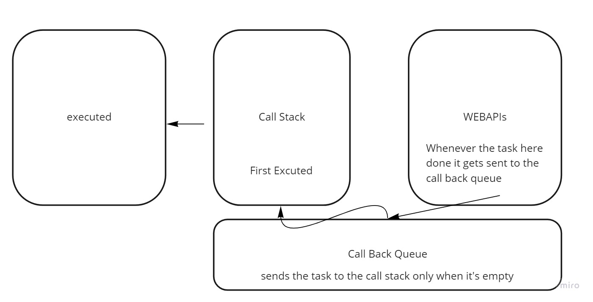

## Event Loop

Basically to understand how JS executes in simple plain words you’ll have to imagine two main blocks they are called call stack and callback queue. And there is a supporting block (lets agree to call it a supporting block) and that depends on the runtime environment ex: in chrome the runtime environment is called V8 engine and the supporting block is called WEBAPIs.

The call stack is how the interpreter usually stacks the code to execute it, first called first interpreted. Also JS by default is synchronously interpreted and sometimes you just don’t want that, such as when you are sending XHR requests or consuming API data there is usually some delay in the response from the server and that might cause unintentional errors such as the delay in the app or Blocking to avoid this firstly the call back queue was introduced which only executes when the call stack is completely empty.

The call back queue solved too many issues but still there are some and to completely solve this the asynchronous functions were introduced, which are functions that only gets popped of the call stack when they are completely finished.

The following figure illustrates how the event loop works in the V8 engines:



## Callback Functions

Sometimes you need to make sure that the function isn’t called only in certain place in this case we use callback functions. Callback functions are function that are called by another functions, the most common uses for them are event listeners and in array methods.

## Promises

To handle asynchronous operations in JS you’ll have to first understand promises, a promise is an object that will introduce some value in the future. A promise has four states: fulfilled: Action related to the promise succeeded, rejected: Action related to the promise failed, pending: Promise is still pending i.e. not fulfilled or rejected yet and settled: Promise has fulfilled or rejected.
To handle promises you’ll need to use then and catch method and use the callback function logic in them ex:

```
promise.then(function(result){
        //handle success
    }, function(error){
        //handle error
    })
```

```
promise.catch(function(error){
        //handle error
    })
```

## Async/Await Function in JavaScript

Async: to write asynchronous based code as if it were synchronous you simply use async before the function and JS will take care of not breaking the execution thread A value is always returned by async functions. By ensuring that a promise is returned, and if it isn't, JS wraps it in a promise that is resolved with the promise's value.

Await: To wait for the promise, the await function is used. It could only be used in the async block. It forces the code to wait for the promise to produce a result. It does nothing but make the async block wait.

## Test-Driven Development

TDD is a software development methodology in which test cases are created to define and validate what the code will accomplish. There is two approaches for TDD:
1- Manual Testing: is simply testing the software as you are the user and d navigating around in an attempt to test functionality and find bugs.
2- Automated Testing: write a code to check the code for you. This approach has a setback of not being able to change the specifications easily.

### Automated Testing using JEST

tests are function that receives a couple of arguments, we call our test with **it()** or **test()**

```
//filename.test.js

test("testing filename", ()==>{
    expect(1).toBe(1);
})
```

- test() arguments:

  1. a title or description **"testing filename""**
  2. a function to assert something about our code **expect(1).toBe(1)**, here in expect we can check a variable in our code and in toBe we put our assertion of that variable. in this example it's always true so the test will always pass

- The second argument we pass is a function where we actually assert something about our code.
